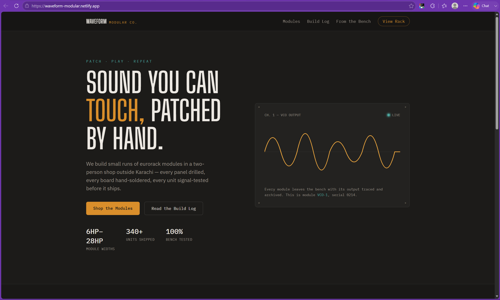
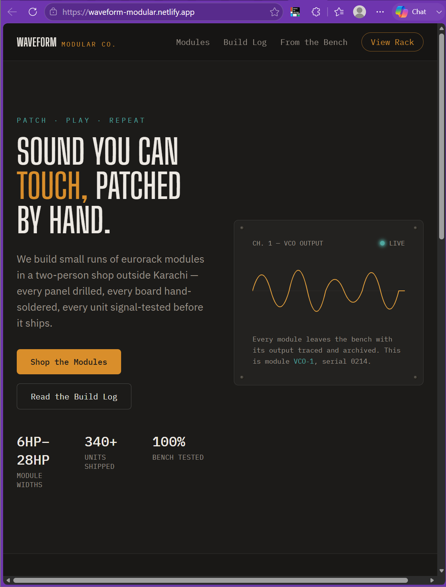

# Waveform Modular — Landing Page

🔗 **[Live Site](https://waveform-modular.netlify.app/)**

A responsive, interactive landing page for a small eurorack synth-module shop. Built across four weeks: Figma-style design, semantic HTML5 + Tailwind CSS layout, JavaScript interactivity, and finally production deployment with SEO and performance polish.

## Tech Stack

- HTML5 (semantic markup)
- Tailwind CSS (Play CDN)
- Vanilla JavaScript (ES6, DOM APIs, no framework)
- Google Fonts
- Git & GitHub
- Netlify (CI/CD — every push to `main` auto-deploys)

## Features

-  **Light / dark mode** — toggle in the navbar, persists across page reloads via `localStorage`
-  **Responsive, mobile-first layout** — hamburger navigation on small screens, no horizontal scroll at any width
-  **FAQ accordion** — smooth expand/collapse, keyboard and screen-reader accessible (`aria-expanded`)
-  **Real-time form validation** — inline red/green feedback as the user types, before submission
-  Animated SVG oscilloscope trace in the hero section
-  **SEO & social sharing ready** — descriptive meta tags, OpenGraph + Twitter Card previews, custom favicon

## Screenshots

**Desktop**


**Narrow / mobile-width view**


## Running locally

Just open `index.html` in a browser — no install or build step needed.

## Project structure

```
waveform-modular/
├── index.html       — page structure, content, SEO/OG meta tags
├── script.js         — dark mode, mobile menu, FAQ accordion, form validation
├── favicon.svg        — browser tab icon
├── og-image.png        — social sharing preview image
└── README.md
```
